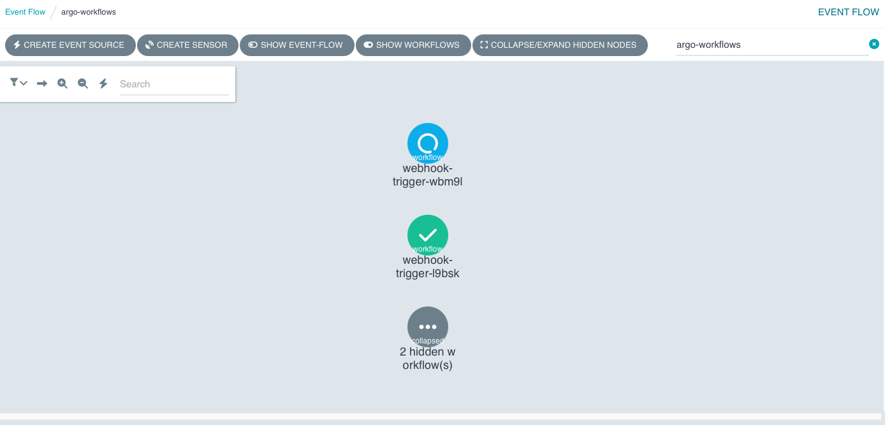
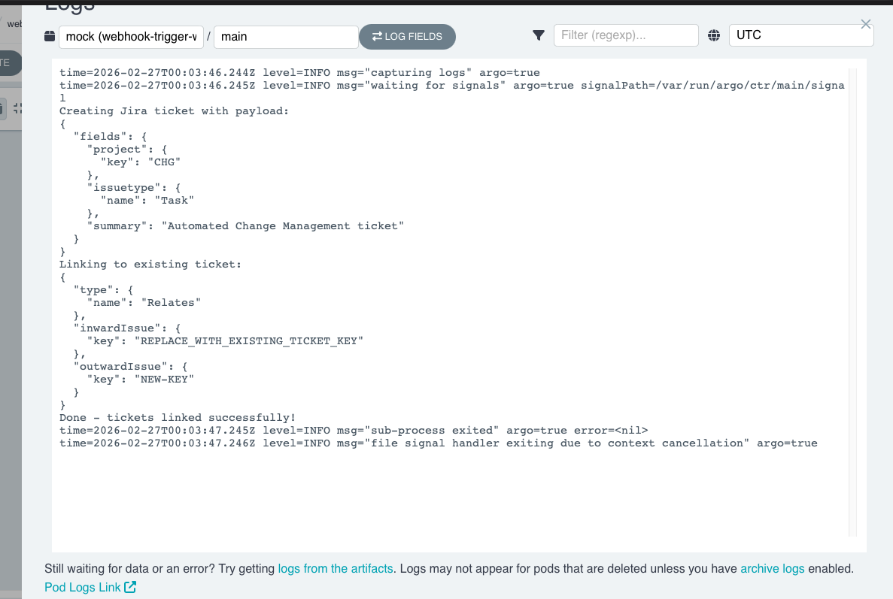
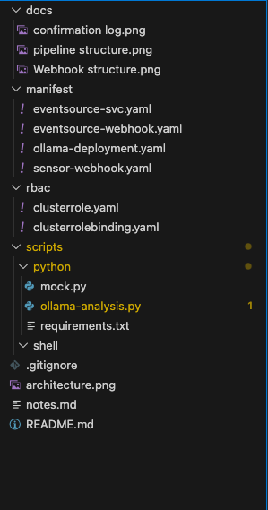
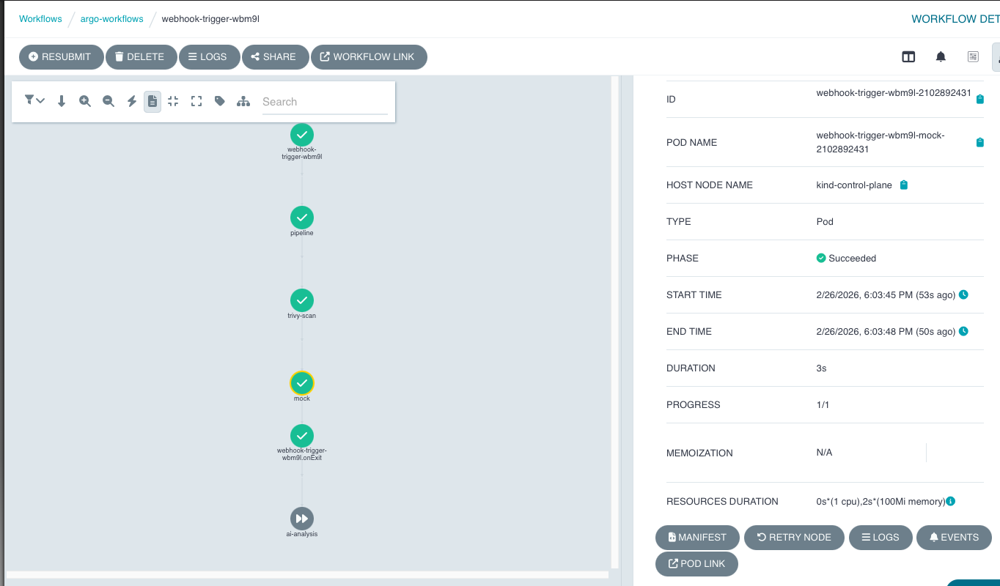

# Argo Events & Workflows — Event-Driven CI/CD Pipeline

## Overview

This project demonstrates a production-minded, event-driven CI/CD pipeline built on
Kubernetes using Argo Events and Argo Workflows. A webhook event activates a code push
trigger, which then flows through an event bus into a multi-step workflow that performs a
security scan, creates and links Jira-style tickets across boards, and uses a locally
hosted AI model to automatically analyze and summarize any pipeline failures in plain
English (all while running on a local kind cluster.)

## Architecture

```
Webhook (curl / GitHub)
        ↓
EventSource (argo-events) — listens on port 12000 at /push
        ↓
NATS EventBus — passes event to Sensor
        ↓
Sensor — evaluates dependency, submits Workflow
        ↓
Argo Workflow (argo-workflows)
    ├── Step 1: Pipeline  — activates build/deploy
    ├── Step 2: Trivy     — scans image for HIGH/CRITICAL CVEs
    ├── Step 3: Mock      — creates CHG ticket, links to existing ticket
    └── onExit Handler
        └── AI Analysis   — calls Ollama/TinyLlama on failure,
                            generates plain English root cause summary
```

> The EventBus uses the Argo Events default NATS configuration — no custom manifest required for single-cluster use.

## Components

**Argo Events** handles the event ingestion layer. An EventSource pod listens for
incoming HTTP POST requests and publishes them to the NATS EventBus. The Sensor
subscribes to those events and submits an Argo Workflow when the dependency condition
is met.

**Argo Workflows** orchestrates the pipeline steps. Each step runs in its own
container, scoped and isolated. The workflow uses an exit handler pattern to
conditionally trigger AI analysis only on failure.

**Trivy** is integrated as a pipeline gate. If the image scan finds HIGH or CRITICAL
vulnerabilities the workflow fails at that step and the remaining steps do not run.

**Mock** achieves cross-board ticket linking using the Jira REST API structure.
The script creates a Change Management ticket and links it to an existing ticket using
the "Relates" relationship. Named Mock intentionally — the ticket linking logic is not
Jira-specific and can be adapted to any ticketing system that supports a REST API with
relationship linking. In a production environment, replace the mock payloads with real
API credentials and endpoints.

**Ollama + TinyLlama** runs entirely inside the cluster. No external API keys, no
cost. On workflow failure the AI analysis step calls the Ollama service, passes the
workflow name and status as context, and returns a plain English summary with suggested
next steps. This pattern is production-applicable but you'll probably want to swap
TinyLlama for a larger model on a real cluster.

## Prerequisites

- Argo CLI
- Docker Desktop
- kind
- kubectl

## Setup
### 1. Create the kind cluster

```bash
kind create cluster
```

### 2. Create namespaces

```bash
kubectl create namespace argo
kubectl create namespace argo-events
kubectl create namespace argo-workflows
```

### 3. Install Argo Workflows

```bash
kubectl apply --server-side -f https://github.com/argoproj/argo-workflows/releases/latest/download/quick-start-minimal.yaml
```

### 4. Install Argo Events

```bash
kubectl apply -n argo-events -f https://github.com/argoproj/argo-events/releases/latest/download/install.yaml
kubectl apply -n argo-events -f https://raw.githubusercontent.com/argoproj/argo-events/stable/examples/eventbus/native.yaml
```

### 5. Apply RBAC

```bash
kubectl apply -f rbac/clusterrole.yaml
kubectl apply -f rbac/clusterrolebinding.yaml
```

### 6. Deploy manifests

```bash
kubectl apply -f manifest/eventsource-webhook.yaml
kubectl apply -f manifest/eventsource-svc.yaml
kubectl apply -f manifest/ollama-deployment.yaml
kubectl apply -f manifest/sensor-webhook.yaml
```

### 7. Pull the TinyLlama model

```bash
kubectl exec -n argo-workflows deployment/ollama -- ollama pull tinyllama
```

### 8. Port-forward the webhook and Argo UI

```bash
kubectl port-forward svc/webhook-eventsource-svc 12000:12000 -n argo-events &
kubectl port-forward svc/argo-server 2746:2746 -n argo &
```

## Testing the Pipeline

### Trigger a successful run

```bash
curl -d '{"message":"hello"}' -H "Content-Type: application/json" -X POST http://localhost:12000/push
kubectl get workflows -n argo-workflows
```

### Trigger a failure to test AI analysis

In `manifest/sensor-webhook.yaml` change the pipeline template command from
`[echo]` to `[python]`. Busybox doesn't have Python so it will fail.
Apply, fire the webhook, and check the ai-analysis step logs in the Argo UI.

## Screenshots

### Pipeline DAG — Successful Run


### Mock — Ticket Payload Output


### AI Failure Analysis Output


### Webhook Structure ###


## Troubleshooting

**Sensor pod not starting**
Check `kubectl describe sensor webhook -n argo-events`. If `TriggersProvided`
is False, check the operation field in the sensor YAML — v1.9.x requires
`operation: submit`.

**Webhook returns connection refused**
The port-forward is not running. Re-run:
```bash
kubectl port-forward svc/webhook-eventsource-svc 12000:12000 -n argo-events
```

**Workflow fails with RBAC error**
The sensor service account lacks permissions. Verify:
```bash
kubectl get clusterrolebinding webhookRoleBinding -o yaml
```
Ensure the ClusterRole includes `create`, `get`, `list`, `watch` verbs on
`workflows.argoproj.io`.

**Argo Workflows quick-start hardcoded to argo namespace**
The quick-start manifest deploys everything to the `argo` namespace. Workflows
submitted to `argo-workflows` require the sensor to explicitly target that namespace
in the trigger resource definition.

**Empty artifact repository annotation**
If Argo tries to save artifacts to a minio instance that doesn't exist or isn't
configured, add the annotation `workflows.argoproj.io/default-artifact-repository: empty`
to the workflow metadata to bypass it.

**Server-side apply for large CRDs**
Argo CRD manifests exceed kubectl's default apply size limit. Use:
```bash
kubectl apply --server-side
```
or you'll get a metadata annotation too long error.

**EventSource service not auto-created**
The service must be created manually with `eventsource-name: webhook` as the selector label.

**EventSource service has no endpoints**
The service selector may not match the pod labels. Check:
```bash
kubectl get endpoints webhook-eventsource-svc -n argo-events
kubectl get pod -n argo-events -l eventsource-name=webhook
```
Patch the selector if needed.

**AI analysis not firing on failure**
Verify the onExit handler is defined at the workflow spec level, not inside
the entrypoint steps. The `when` condition must be `"{{workflow.status}} == Failed"`.

## Design Decisions

**Why NATS over Kafka for the EventBus?**
For a single-cluster, low-throughput event pipeline, NATS streaming is
operationally simpler. Kafka makes sense when you need replay guarantees at
scale or cross-cluster event distribution. NATS is the right tool here.

**Why separate namespaces for argo-events and argo-workflows?**
RBAC isolation. A compromised workflow pod cannot interact with the event
infrastructure. While it may seem tedious, it limits blast radius.

**Why Ollama over an external AI API?**
No API keys, no egress cost, no external dependency. The model runs inside
the cluster.

**Why TinyLlama?**
It fits in memory on a local kind cluster. For production, swap it for
a larger model on a node with real resources. The integration pattern
is the same regardless.